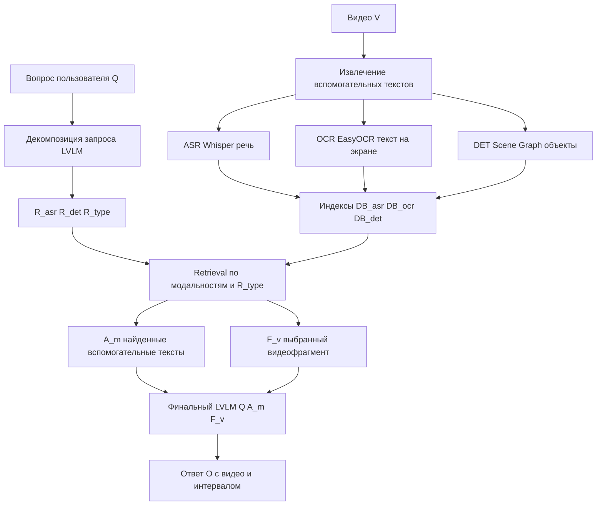

# Video-RAG Research

Учебный исследовательский проект по репликации архитектуры Video-RAG для русскоязычных видео.

Цель проекта: по пользовательскому вопросу найти релевантные интервалы в наборе видео и сформировать ответ с опорой на речь, текст на экране, визуальные объекты и сам видеофрагмент.

## Ссылки

- [Статья Video-RAG, arXiv:2411.13093](https://arxiv.org/abs/2411.13093)
- [Официальный репозиторий Video-RAG](https://github.com/Leon1207/Video-RAG-master)

## Архитектура

Пайплайн повторяет три основные стадии Video-RAG:

1. `Query Decouple`: LVLM преобразует вопрос `Q` в `R = {R_asr, R_det, R_type}`.
2. `Auxiliary Text Generation & Retrieval`: строятся и ищутся вспомогательные тексты по трём модальностям.
3. `Integration & Generation`: найденные тексты `A_m`, вопрос и видеофрагмент передаются в LVLM для финального ответа.



Модальности:

- `ASR`: речь из видео через Whisper.
- `OCR`: текст на кадрах через EasyOCR.
- `DET`: scene graph по кадрам; записи разделены по `R_type`: `location`, `number`, `relation`.

Текущая реализация использует Gemini для LVLM-стадий, TEI для эмбеддингов и локальный Qdrant для индексов.

## Установка

```bash
python -m venv .venv
source .venv/bin/activate
pip install -r requirements.txt
python -m spacy download en_core_web_sm
```

Нужен `ffmpeg`:

```bash
brew install ffmpeg
```

`en_core_web_sm` используется только в `DET`: BLIP выдаёт англоязычные описания кадров, а spaCy разбирает их в scene graph. Русские `ASR` и `OCR` через spaCy не проходят.

## Настройка

Создай `.env` из примера:

```bash
cp .env.example .env
```

Минимально нужны:

```env
GOOGLE_API_KEYS=key_1,key_2
EMBEDDING_BACKEND=tei
TEI_ENDPOINT=<tei-embedder-url>
```

Ключи Gemini задаются через запятую и перебираются по очереди. Адрес TEI не выводится в логах.

Основной конфиг находится в `configs/config.yaml`.

## Данные

Исходные материалы кладутся в `lera_materials/`. Подготовленные видео сохраняются в `data/videos/`.

```bash
python -m scripts.prepare_dataset --config configs/config.yaml
```

## Индексация

```bash
python -m scripts.build_index --config configs/config.yaml --recreate
```

Команда извлекает или берёт из кэша `ASR`, `OCR`, `DET`, считает эмбеддинги и записывает индексы в Qdrant.

## Запросы

Только поиск по индексам:

```bash
python -m scripts.search --config configs/config.yaml "Где в видео говорят про роблокс?"
```

Полный Video-RAG с финальным ответом:

```bash
python -m scripts.ask --config configs/config.yaml "Где в видео говорят про роблокс?"
```

Показать найденный контекст:

```bash
python -m scripts.ask --config configs/config.yaml --show-context "Где в видео говорят про роблокс?"
```

## Структура

```text
configs/config.yaml        основной конфиг
lera_materials/            исходные материалы
scripts/prepare_dataset.py подготовка видео
scripts/build_index.py     построение индексов
scripts/search.py          поиск по индексам
scripts/ask.py             поиск и финальный ответ
src/generation/            Gemini LVLM-стадии
src/modules/               ASR, OCR, DET
src/retrieval/             эмбеддинги, Qdrant, TEI-клиент
src/pipeline.py            общий пайплайн
```
