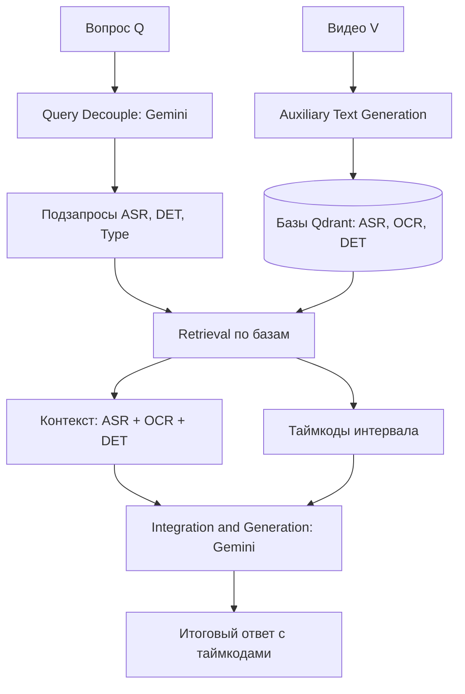

# Video-RAG Research: Универсальный пайплайн поиска по видео

Интеллектуальная система мультимодального семантического поиска и генеративного ответа (Video-RAG) для русскоязычного видеоконтента.

[](#веб-интерфейс-mvp)
[](#результаты-и-метрики)

---

## 1. Какую проблему решает проект?
Классический поиск по видео ограничен метаданными (название, теги, описание). Проект реализует **внутрикадровый семантический поиск** по трем модальностям (речь, текст на экране, визуальные объекты) и формирует генеративный ответ с указанием точных таймкодов появления ответа в видео.

## 2. Кто целевой пользователь?
- **Образовательные платформы**: поиск нужного фрагмента лекции по терминам.
- **Медиа-сервисы и видеохостинги**: семантическая навигация по каталогу фильмов и шоу.
- **Контент-менеджеры**: быстрый поиск сцен, фраз или брендов (логотипов) на видео.

## 3. Эволюция проекта
Проект зародился в контексте хакатона **AI CHAMP 2026 / Okko**. Исходное решение опиралось исключительно на транскрипции речи (ASR) и содержало закрытые брендовые зависимости.
После хакатона проект был полностью переработан:
- Убраны доменные зависимости сервиса Okko.
- Пайплайн превращен в универсальный инструмент для работы с любыми русскоязычными видеофайлами.
- Интегрированы две новые модальности: **OCR** (распознавание текста в кадре) и **DET** (построение визуальных scene graph описаний).
- Разработан FastAPI-бэкенд и адаптивный веб-интерфейс для интерактивного тестирования.

## 4. Что реализовано лично мной (Максим Ляра)?
- Архитектура интеграционного пайплайна (`src/pipeline.py`) и система конфигурации (`configs/config.yaml`).
- Модуль векторного индексирования в локальной базе **Qdrant** с поддержкой локального эмбеддинга Hugging Face и внешнего TEI-сервиса.
- Механизм кэширования промежуточных этапов обработки (ASR/OCR/DET) в структурированных JSON-артефактах для предотвращения повторных дорогих вычислений.
- FastAPI бэкенд (`app.py`) и адаптивный веб-интерфейс (`static/index.html`) для интерактивной демонстрации MVP.

## 5. Архитектура системы

Пайплайн базируется на трех стадиях оригинальной статьи **Video-RAG (arXiv:2411.13093)**:
1. **Query Decouple**: Gemini-модель преобразует вопрос пользователя в структурированные подзапросы для речи (ASR) и визуальных объектов (DET).
2. **Auxiliary Text Retrieval**:
   - **ASR**: Речь извлекается с помощью модели Whisper.
   - **OCR**: Текст с кадров считывается через EasyOCR с шагом 5 секунд.
   - **DET**: Кадры описываются моделью BLIP, затем spaCy разбирает их на scene graph сущности (`location`, `number`, `relation`).
   - Мультимодальный контекст векторизуется моделью `Qwen3-Embedding-0.6B` и ищется в векторной базе `Qdrant`.
3. **Integration & Generation**: Найденные текстовые ASR/OCR/DET-контексты и исходный вопрос объединяются и передаются в Gemini для генерации ответа. В текущей конфигурации по умолчанию (`max_video_candidates: 0`) видеокадры напрямую в Gemini не отправляются, чтобы исключить сетевые задержки и затраты токенов, опираясь исключительно на извлеченные текстовые модальности.


```mermaid
graph TD
    Q[Вопрос Q] --> D[Query Decouple: Gemini]
    D --> R[Подзапросы ASR, DET, Type]

    V[Видео V] --> AUX[Auxiliary Text Generation]
    AUX --> DB[(Базы Qdrant: ASR, OCR, DET)]

    R --> RET[Retrieval по базам]
    DB --> RET
    RET --> AM[Контекст: ASR + OCR + DET]
    RET --> INT[Таймкоды интервала]

    AM --> GEN[Integration and Generation: Gemini]
    INT --> GEN
    GEN --> O[Итоговый ответ с таймкодами]
```

## 6. Отличия от статьи и хакатонного прототипа
- В отличие от оригинальной статьи, ориентированной на англоязычный поиск, в пайплайн добавлена **полная локальная адаптация под русский язык** (Whisper ASR, EasyOCR русский словарь, русскоязычная нормализация текстов).
- В отличие от хакатонного прототипа, решение стало мультимодальным (добавились OCR и визуальные признаки) и приобрело готовый пользовательский веб-интерфейс.

## 7. Веб-интерфейс (MVP)
Интерфейс предоставляет пользователю возможность:
1. Загружать видеофайлы через drag-and-drop.
2. Отслеживать прогресс индексации (ASR, OCR, DET) в реальном времени с выводом логов.
3. Выполнять текстовые поисковые запросы.
4. Просматривать найденные релевантные кадры, транскрипции и читать итоговый ответ модели.

---

## 8. Быстрый запуск

### Зависимости и окружение:
```bash
python -m venv .venv
source .venv/bin/activate
pip install -r requirements.txt
python -m spacy download en_core_web_sm
```

### Настройка `.env`:
Создайте файл `.env` на основе примера. По умолчанию поддерживаются два режима эмбеддинга:
- `EMBEDDING_BACKEND=local` — локальный инференс модели эмбеддинга `Qwen3-Embedding-0.6B` на MPS/CPU.
- `EMBEDDING_BACKEND=tei` — обращение к высокопроизводительному контейнеру Text Embeddings Inference (требует запущенного инстанса TEI на порту 8080).

Пример настройки `.env`:
```env
EMBEDDING_BACKEND=local
GOOGLE_API_KEYS=your_gemini_api_key
```

> [!NOTE]
> `Dockerfile` в репозитории предназначен для экспериментального деплоя пайплайна (в настоящий момент сборка Docker-образа под macOS не верифицирована до конца). Рекомендуется использовать стандартный локальный запуск.

### Запуск веб-интерфейса:
```bash
uvicorn app:app --reload
```
После запуска откройте в браузере: `http://127.0.0.1:8000`

---

## 9. CLI команды пайплайна

1. **Подготовка видеоматериалов**:
   ```bash
   python -m scripts.prepare_dataset
   ```
2. **Построение векторного индекса в Qdrant**:
   ```bash
   python -m scripts.build_index --recreate
   ```
3. **Поиск релевантных интервалов по запросу**:
   ```bash
   python -m scripts.search "Где в видео говорят про роблокс?"
   ```
4. **Запуск полного Video-RAG (поиск + генерация ответа)**:
   ```bash
   python -m scripts.ask --show-context "Как завязать галстук?"
   ```

---

## 10. Результаты и метрики

По результатам тестирования на демонстрационном датасете (10 запросов, 30 видеофайлов):
- **ASR-only**: Hit@1 = 70.0%, Hit@3 = 80.0% (включая Speech Hit@1 = 100.0%, OCR/Visual Hit@1 = 40.0%).
- **Multimodal (Гибрид ASR + OCR + DET)**: Hit@1 = 60.0%, Hit@3 = 70.0% (включая Speech Hit@1 = 80.0%, OCR/Visual Hit@1 = 40.0%).

*Интерпретация результатов*: Дополнительные OCR и DET признаки содержат уникальную информацию, которая отсутствует в ASR (например, текстовые титры и визуальные объекты). Однако простое фиксированное слияние модальностей в текущей версии пайплайна снижает итоговую точность Hit@1. Для улучшения качества требуется динамическая классификация/маршрутизация запросов (Query Routing) и динамическое взвешивание скоров.

## 11. Ограничения системы
- **Ресурсоемкость извлечения**: Извлечение признаков OCR и DET по кадрам требует значительного времени GPU при первичной обработке (нивелируется кэшированием в JSON-артефактах).
- **Зависимость от LLM API**: Query Decouple и Generation зависят от доступности и лимитов API Gemini.

---

## Ссылки
- [Официальный репозиторий Video-RAG](https://github.com/Leon1207/Video-RAG-master)
- [Статья Video-RAG, arXiv:2411.13093](https://arxiv.org/abs/2411.13093)
